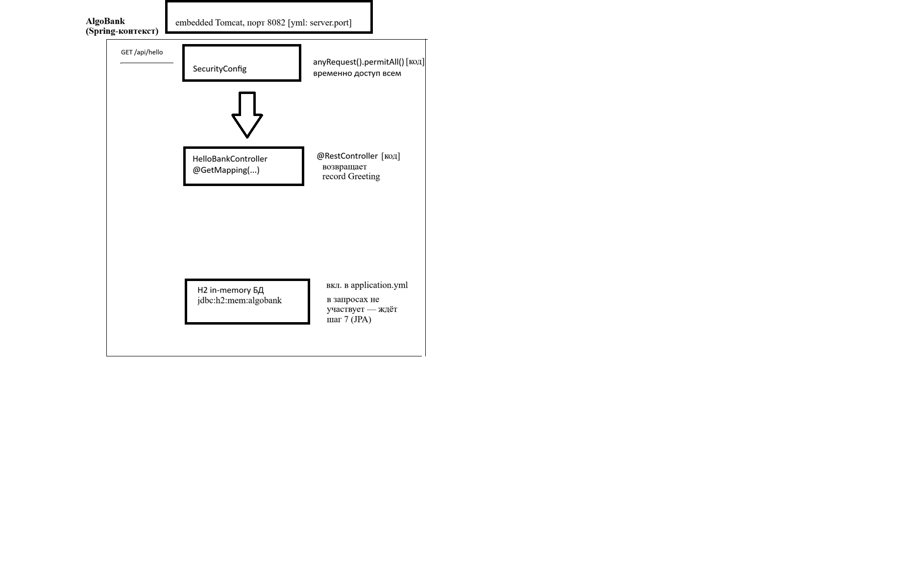

# 🏦 AlgoBank

Это учебный банковский backend на Spring Boot, 
через который я готовлюсь к собеседованию Java-разработчика.
Курс идёт с AI-ментором: задачи и код пишу сам, ассистент ставит вопросы,
проверяет, разбирает ошибки.
Используется LLM агент kimi-k3:cloud. В планах фронтенд на react.

## 🛠 Технологии
- Java 21 / Spring Boot 4.0.8
- Maven, JUnit 5
- H2 (dev), Flyway, Spring Data JPA

## 🚀 Как запустить

```bash
git clone https://github.com/VasiliiBasov/AlgoBank.git
cd AlgoBank
mvn spring-boot:run
```

- Проверка: http://localhost:8082/api/hello
- H2-консоль: http://localhost:8082/h2-console (JDBC URL: `jdbc:h2:mem:algobank`, user `sa`, пароль пустой)

## 📡 Сейчас в проекте
- `GET /api/hello` → JSON-приветствие
- H2-консоль: `/h2-console` (jdbc:h2:mem:algobank)
- Алгоритмические задачи: `ru.algobank.algo.step01..05` + JUnit-тесты

### Архитектура (шаг 5)



Схема потока `GET /api/hello`: embedded Tomcat → SecurityConfig → HelloBankController → record Greeting. H2 подключена, но в запросах пока не участвует — ждёт JPA.

Цель шагов 6–7 — полноценные слои: [Service (бизнес-логика) и Repository + Entity (SVG-схема)](docs/architecture-step06-07.svg).

## 🧪 Тесты

```bash
mvn test
```

Каждая алгоритмическая задача шагов закрывается JUnit 5 тестами (правило курса). На 19.09.2026 покрыто **8 тест-кейсов** (FizzBuzz, BankGreeter и др.).

## 🗺 Статус

Учебный курс-проект: **26 шагов** (Java Core → Spring Boot → многопоточность → SQL → алгоритмы → mock-собеседование).

**Текущий шаг: 5 / 26** — Spring Boot REST basics.

Дневники прогресса ведутся прямо в репозитории: `PROGRESS.md`, `STATS.md`, `LEARNING_LOG.md`.